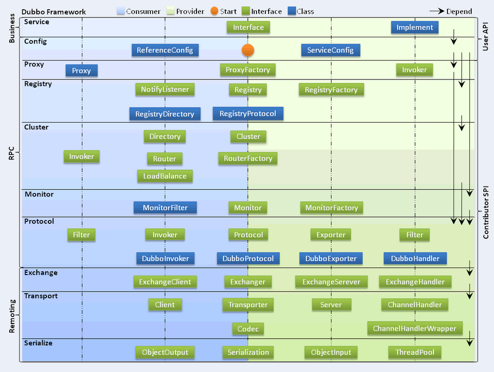

1. Dubbo是什么
> Dubbo是一个分布式、高性能、透明化的RPC服务框架，提供服务自动注册、自动发现等高效服务治理方案，可以和Spring框架无缝集成

2. 主要的应用场景
>- 透明化的远程方法调用，就像调用本地方法一样调用远程方法，只需要简单的配置，没有任何API侵入
>- 软负载均衡及容错机制，可以在内网替代F5等硬件负载均衡器，降低成本，减少单点
>- 服务的自动注册与发现，不再需要写死服务提供方地址，注册中心基于接口名查询服务提供者的IP地址
> 并且能够平滑添加和删除服务提供者

3. Dubbo的核心功能
> 主要有以下3个核心功能
>- Remoting,网络通信框架，提供多种NIO框架抽象封装，包含"同步转异步"和"请求-响应"模式的信息交换方式
>- Cluster,服务框架，提供基于接口方法的透明远程过程调用，包含多协议支持，以及软负载均衡，失败容错，
地址路由，动态配置等集群支持
>- Registry,服务注册，基于注册中心目录服务，使服务消费方能动态的查找服务提供方，使地址透明，使服务提供者可以
平滑的添加和删除服务提供者

4. Dubbo的核心组件
>- Provider,暴露服务的服务提供方
>- Consumer,调用远程服务的服务消费方
>- Registry,服务注册与发现的注册中心
>- Monitor,统计服务的调用次数和调用时间的监控中心
>- Container,服务运行容器

5. Dubbo服务注册与发现流程

>- 0服务容器Container负责启动，加载，运行服务提供者。
>- 1服务提供者Provider在启动时，向注册中心Registry注册自己提供的服务。
>- 2服务消费者Consumer在启动时，向注册中心Registry订阅自己所需的服务。
>- 3注册中心Registry返回服务提供者地址列表给消费者，如果有变更，注册中心将基于长连接推送变更数据给消费者。
>- 4服务消费者，从提供者地址列表中，基于软负载均衡算法，选一台提供者进行调用，如果调用失败，再选另一台调用。
>- 5服务消费者和提供者，在内存中累计调用次数和调用时间，定时每分钟发送一次统计数据到监控中心Monitor。

6. Dubbo的设计思路原因
>- Consumer与Provider解耦，双方都可以横向增减节点
>- 注册中心对本身可做对等集群，可动态增加节点，并且任意一台宕机，将自动切换到另一台
>- 去中心化，双方不直接依赖注册中心，即使注册中心全部宕机短时间内也不会影响服务的调用
>- 服务提供者无状态，任意一台宕机，不影响使用

7. Dubbo的十层架构设计

> Dubbo 总体架构分为10层，左蓝是消费者使用的接口，右绿为服务提供方使用接口，中轴线是双防均用的接口
>- 服务接口层（Service）：该层是与实际业务逻辑相关的，根据服务提供方和服务消费方的业务设计对应
> 的接口和实现。
>- 配置层（Config）：对外配置接口，以ServiceConfig和ReferenceConfig为中心，可以直接new配置类，
> 也可以通过spring解析配置生成配置类。
>- 服务代理层（Proxy）：服务接口透明代理，生成服务的客户端Stub和服务器端Skeleton，
> 以ServiceProxy为中心，扩展接口为ProxyFactory。
>- 服务注册层（Registry）：封装服务地址的注册与发现，以服务URL为中心，扩展接口为RegistryFactory、
> Registry和RegistryService。可能没有服务注册中心，此时服务提供方直接暴露服务。
>- 集群层（Cluster）：封装多个提供者的路由及负载均衡，并桥接注册中心，以Invoker为中心，
> 扩展接口为Cluster、Directory、Router和LoadBalance。将多个服务提供方组合为一个服务提供方，
> 实现对服务消费方来透明，只需要与一个服务提供方进行交互。
>- 监控层（Monitor）：RPC调用次数和调用时间监控，以Statistics为中心，扩展接口为MonitorFactory、
> Monitor和MonitorService。
>- 远程调用层（Protocol）：封将RPC调用，以Invocation和Result为中心，扩展接口为Protocol、Invoker
>和Exporter。Protocol是服务域，它是Invoker暴露和引用的主功能入口，它负责Invoker的生命周期管理。
> Invoker是实体域，它是Dubbo的核心模型，其它模型都向它靠扰，或转换成它，它代表一个可执行体，
> 可向它发起invoke调用，它有可能是一个本地的实现，也可能是一个远程的实现，也可能一个集群实现。
>- 信息交换层（Exchange）：封装请求响应模式，同步转异步，以Request和Response为中心，
> 扩展接口为Exchanger、ExchangeChannel、ExchangeClient和ExchangeServer。
>- 网络传输层（Transport）：抽象mina和netty为统一接口，以Message为中心，扩展接口为Channel、
> Transporter、Client、Server和Codec。
>- 数据序列化层（Serialize）：可复用的一些工具，扩展接口为Serialization、 ObjectInput、
> ObjectOutput和ThreadPool

8. Dubbo 支持哪些协议
>- dubbo协议，单一长连接和NIO异步通讯，适合大并发小数据量的服务调用，以及消费者远大于提供者
，传输协议TCP，异步，Hessian序列化
>- RMI协议，采用JDK标准的rmi协议失效，传输参数和返回参数对象需要实现序列化，使用ava标准序列化机制，
阻塞式短连接，传输数据包大小混合，消费者和提供者个数差不多，可传文件，传输协议TCP多个短连接
，同步传输，适用常规的远程调用和rmi互操作，在依赖低版本的Common-Collections包，java序列化存在安全漏洞
>- webservice协议，基于webservice的远程调用协议，集成CXF实现，提供和原生webservice的互操作。
多个短连接，基于http传输，同步传输，适用于系统集成和跨语言调用
>- http协议，基于http表单提交的远程调用协议，适用Spring的HttpInvoke实现，多个短连接，传输协议http，传输参数大小混合，
提供者个数多于消费者，需要给应用程序和浏览器JS调用
>- hessian协议，集成Hessian服务，基于http通讯，采用Servlet暴露服务，Dubbo内嵌jetty做为服务器默认实现，提供与Hessian服务
互操作，多个短连接，同步http传输，Hessian序列化，传入参数较大，提供者大于消费者，提供者压力大，可传输文件
>- memcache，基于memcache实现的RPC协议
>- redis,基于redis实现的RPC协议

9. Dubbo有哪些注册中心
>- Multicast注册中心，不需要任何中心节点，只要广播地址，就能进行服务注册与发现，基于网络
中组播传输实现
>- zk，基于分布式协调系统zk实现，采用zk的watch机制实现数据变更
>- redis，基于redis实现，采用可以key/Map实现，
>- Simple 注册中心

10. 为什么需要服务治理
>- 过多的url篇日志困难
>- 负载均衡分配节点压力过大的情况下也需要部署句群
>- 服务依赖混乱，启动顺序不清晰
>- 过多服务导致性能指标分析难度过大，需要监控

11. Dubbo与spring的关系
> Dubbo采用全Spring配置方式，透明化接入应用，对应用没有任何API侵入，只需用Spring
加载Dubbo的配置即可，Dubbo基于Spring的Schema扩展进行加载

12. Dubbo使用什么通信框架
> 默认使用NIO Netty框架

13. Dubbo集群提供了哪些负载策略
>- Random LoadBalance随机选取提供策略，有利于动态调整提供者权重，截面碰撞概率，调用
次数越多，分布越均匀，默认策略
>- RoundRobin LoadBalance,轮询选取提供者策略，平均分布，但是存在请求累计的问题
>- LeastActive LoadBalance,最少活跃调用策略，解决慢提供者接收更少的请求
>- ConstantHash LoadBalance,一致性Hash策略，使相同参数请求总是发到统一提供者，一台
机器宕机，可以基于虚拟节点，分摊至其他提供者，避免引起提供者的剧烈变动

14. Dubbo 的集群容错方案有哪些
> 通过<dubbo:servce 或 <dubbo:reference  cluster="faildback" 进行配置
>- Failover Cluster,失败自动切换，重试其他服务器，通常用于读操作，但重试会带来更长的延迟，默认方案
>- FailFast Cluster，快速失败，只发起一次调用，失败立即报错，通常用于非幂等性的写操作，
如新增记录
>- Failsafe Cluster，失败安全，出现异常时，直接忽略，通常用于写入审计日志等操作
>- FaildBack Cluster，失败能自动恢复，后台记录失败请求，定时重发，通常用于消息通知操作
>- Forking Cluster，并行调用多个服务器，只要一个成功即返回，通常用于实时性要求较高的
读操作，但需要浪费更多的服务资源，可通过forks="2" 来设置最大并发数
>- Broadcast Cluster 广播调用所有提供者，逐个调用，任何一台服务报错则报错，通常用
与通知所有提供者更新换错或日志等本地资源信息

15. Dubbo支持的序列化方式
> 默认Hessian序列化，还有Dubbo、FastJson、java自带序列化

16. Dubbo超时时间怎么设置
> 可在provider或consumer设置超时时间，consumer端优先级更高，
服务调用超时不成功，默认是会重试两次的

17. Dubbo在安全机制方面是如何解决的
> Dubbo 通过Token令牌防止用户绕过注册中心直连，然后在注册中心上管理授权，Dubbo
还提供服务黑白名单，来控制服务所允许的调用方

18. Dubbo和Dubbox之间的区别
> dubbox 基于Dubbo上做了一些扩展，如加了服务科restful调用，更新了开源组件等

19. Dubbo和Spring Cloud的关系
> Dubbo是SOA时代的产物，他的关注点主要在于服务的调用，流量分发、流量监控和熔断，
而spring cloud 诞生于微服务架构时代，考虑的是微服务治理的方方面面，另外由于依托了
Spring、Springboot的优势之上，两个框架的开始目标就不一致，Dubbo定位服务治理，
Spring Cloud 是一个生态

20. Dubbo的SPI

