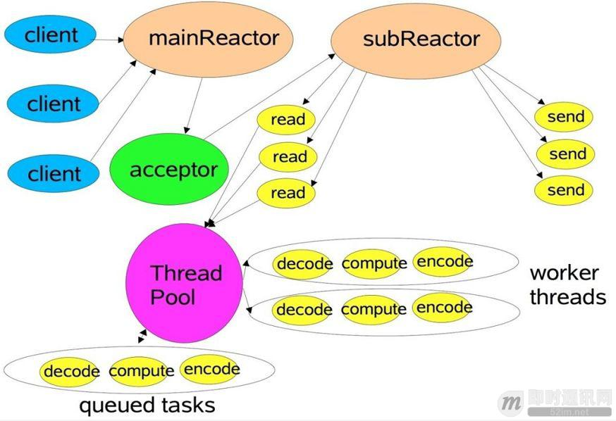
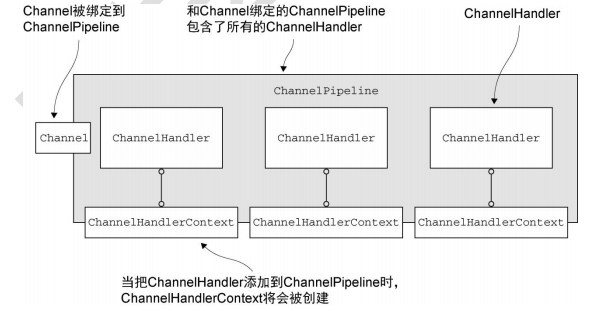
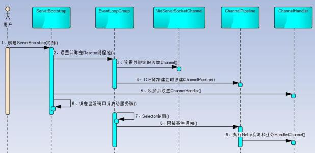
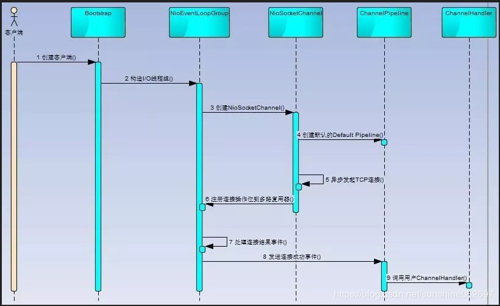

### Netty
> 异步驱动网络框架，采用多线程Reactor模式

>多线程Reactor模式，reactor线程池中，每一个线程都有自己的Selector、线程和分发的
>事件循环逻辑
>- mainReactor可以有一个或多个，负责建立连接，subReactor负责与客户端通信，即
>所有的I/O操作(accept()、read()、write()、connect()) 由reactor线程操作，
>ThreadPool 仅用来处理非I/O操作


###netty 核心组件介绍
##### EventLoop
>处理所有注册到本线程的Selector上面的Channel
#####Bytebuf

##### Channel
> 传入/传出 的载体，可以关闭打开,注册到EventLoop中处理I/O事件
>
>当事件发生时，会转发给ChannelPipeline中的ChannelHandler，

> 生命周期，整个生命周期都只在<u>**一个EventLoop**</u>及其相关的一个线程中
> 
>- ChannelUnregistered 已经被创建，但是未注册
>- ChannelRegistered 已经注册
>- ChannelActive 已经连接
>- ChannelInactive 没有连接到远程

>***常用方法***

|名称|描述
|---|---
|write|
|flush|
|writeAndFlush|
|eventLoop|
pipeline|
|isActive|是否活动的，如Socket是否连接，Datagram是否打开
|localAddress|
|remoteAddress|

##### 回调ChannelFuture
> Channel处理完之后的回调,通过添加ChannelFutureListener，监听完成情况

##### Channel与pipeline、handler、handlerContext关系图

##### ChannelPipeline
>Channel被创建时会自动分配一个ChannelPipeline，用来注册ChannelHandler，用来控制Handler的处理顺序
##### ChannelHandlerContext
>每一个ChannelHandler被注册到pipeline都会有一个ctx上下文，主要用于写出站信息，通过firexxxxx()传递事件
##### ChannelHandler
> 一个pipeline可以链式注册N个handler，一个handler就是一个ctx，
>- ChannelInboundHandler 入站处理器
>- ChannelOutboundHandler 出站处理器
##### ChannelOption
#####  
#####内置通信模式
>- nio模式,在io.netty.channel.nio包下，基于java选择器Selector的模式
>- oio模式，在io.netty.channel.oio包下，基于java的阻塞流
>- epoll模式，由JNI驱动的epoll()和非阻塞io，速度快，只支持在linux下运行
>- local，本地模式，通过VM管道通信
>- embedded，允许使用ChanelHandler不需要网络环境，用来测试


##### 服务创建时序图

>1. 创建ServerBootStrap实例
>2. 设置并绑定Reactor线程池：EventLoopGroup分配EventLoop，EventLoop进行处理
>3. 设置并绑定服务端的channel
>4. 添加ChildHandler，通过ChannelPipeline添加ChannelHandler
>5. 绑定监听端口，启动服务
>6. Selector轮询，等待网络时间通知
>7. 执行Handler
##### 客户端创建时序图


#####nagle算法
> TCP/IP协议中，无论多少数据都要加上协议头，同时接受到消息后要进行ACK确认，
>为了尽可能利用带宽，TCP/IP每次都希望发送的数据包足够大，Nagle算法就是为了
>能够尽可能发送大数据块
#####TCP延迟确认
> 服务收到消息不会立马ACK，会等待一个事件t，等待服务返回给客户端的数据包，
>ACK随数据包返回，如果超了t，会直接ACK，通过设置TCP_QUICKACK可以取消确
>认延迟
####粘包/半包现象
>一个数据包在转为字节码传输过程中，被拆分，接收时，数据包不完整，导致的解码错误

> netty提供了4种解决粘包的方式
>- FixedLengthFrameDecoder(int frameLength),固定长度拆包，适用于数据包长度固定
>- LineBasedFrameDecoder(int maxLength),按行拆包,数据("\r\n")结尾
>- DelimiterBasedFrameDecoder(int maxFrameLength, ByteBuf delimiter), 固定分隔符拆包，数据必须以分隔符结尾
>- LengthFieldBasedFrameDecoder,基于长度域拆包，包含5个参数
>>- `int maxFrameLength`:包最大长度,
>>- `int lengthFieldOffset`: 长度域偏移量，即长度域所在的位置下标
>>- `int lengthFieldLength`:长度域长度
>>- `int lengthAdjustment`:偏移量矫正
>>- `int initialBytesToStrip`:丢弃起始字节
```
for (int j = 0; j < 100; j++) {
    ByteBuf buf = Unpooled.buffer();
    String s = "呵呵,I am " + j;
    byte[] bytes = s.getBytes("UTF-8");
    //一个长度域为int的整数，占4个字节，长度即：4，偏移量为起始位置即：0，
    //矫正为：0，舍弃字节为前4个即：4
    //长度域拆包对象为：new LengthFieldBasedFrameDecoder(1024, 0, 4, 0, 4)
    buf.writeInt(bytes.length);
    buf.writeBytes(bytes);
    channel.writeInbound(buf);
}
```
####编解码器
- 解码器
> 
- 编码器
#####空闲链接和超时链接
- IdleStateHandler
- ReadTimeoutHandler
- WriteTimeoutHandler
##### 序列化
- JDK自带序列化，使用方便
> 1. 不能跨平台
> 2. 序列化后码流太大
> 3. 序列化性能太低

用来实现RPC框架
Springcloud更加全面，提亮自然就大，dubbo专注RPC，轻，性能更好

