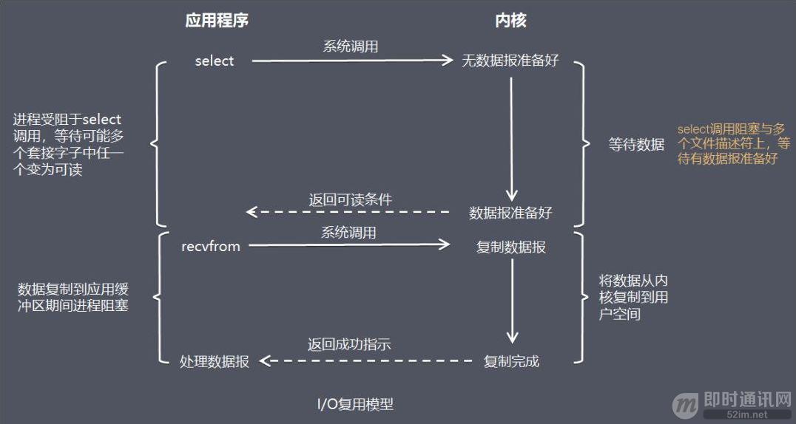
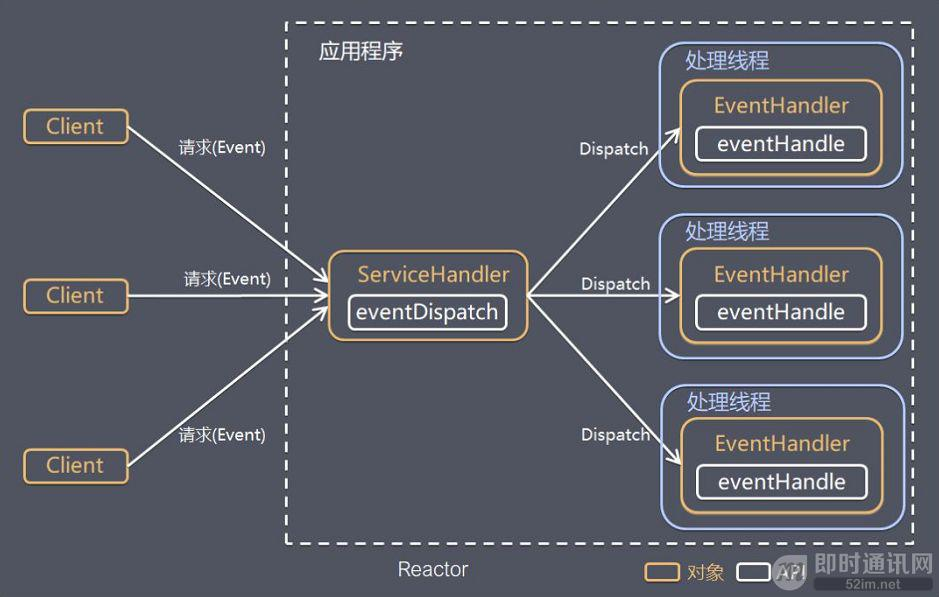

##### NIO核心组件
>相比较BIO，多路复用能使用一个线程监听多个端口事件
>NIO是面向缓冲区的，
+ Selector,多路复用器，用来管理和注册channel
>注册类型SelectionKey分为四类
>- SelectionKey.OP_ACCEPT,服务用来注册连接监听，
>- SelectionKey.OP_READ，用来注册读
>- SelectionKey.OP_CONNECT，客户端用来注册连接
>- SelectionKey.OP_WRITE，注册写
+ Buffer
>缓冲区，通过channel进行读、写	
>>三个核心属性
>>- capacity 缓冲容量大小
>>- position 当前读/写的位置
>>- limit 写时limit就是容量，进行限制，读时是当前缓存区中已写入的终点位置

>方法简介

|方法|描述|
|---|---
|**flip**|写模式切换到读模式**，会把position归零，<br>并设置limit为之前的position的值，即<br>现在position代表的是读取位置，<br>limit标示的是已写入的数据位置
|**get()**|读取buffer数据
|**remaining**|获取limit到position的差
|**hasRemaining**|读没有读完
|**allocate()**|堆内存中获取一个缓冲区
|**allocate_direct()**|直接内存中获取一个缓冲区

>堆内存与直接内存
>- 优点：直接内存减少拷贝时间、垃圾回收的工作，内存读写效率高于堆内存
>- 缺点：难以控制，如果内存泄漏难以排查，
+ Channel
>通道，用来进行读写，所有注册到Selector的通道需是SelectableChannel子类
>- ServerSocketChannel，应用服务的监听通道，支持UDP、TCP，可注册OP_ACCEPT、OP_READ、OP_WRITE
>- SocketChannel, Socket套接字通道，可注册OP_CONNECT、OP_READ、OP_WRITE

>简单用法
>- 开启通道
>- 进行读写
>- 关闭通道


##### 多路复用使用方法
1. Selector的创建 `Selector selector = Selector.open();`
2. 注册channel 到selector,必须是非阻塞的,注册类型需要正确,可同时注册多个
`int interestSet = SelectionKey.OP_READ | SelectionKey.OP_WRITE;`
3. 迭代判断 SelectionKey 感兴趣的监听事件
#####模版代码
```
ServerSocketChannel ssc = ServerSocketChannel.open();
ssc.socket().bind(new InetSocketAddress("localhost", 8080));
ssc.configureBlocking(false);

Selector selector = Selector.open();
ssc.register(selector, SelectionKey.OP_ACCEPT);

while(true) {
    //没有事件进行阻塞
    int readyNum = selector.select();
    if (readyNum == 0) {
        continue;
    }

    Set<SelectionKey> selectedKeys = selector.selectedKeys();
    Iterator<SelectionKey> it = selectedKeys.iterator();

    while(it.hasNext()) {
        SelectionKey key = it.next();

        if(key.isAcceptable()) {
            // 接受连接
        } else if (key.isReadable()) {
            // 通道可读
        } else if (key.isWritable()) {
            // 通道可写
        }
        //获取到感兴趣的监听需后需要移除，否则selector会认为有处理的事件进行重复监听
        it.remove();
    }
}
```

##### Reactor模式，反应堆模式
>控制逆转，具体事件不调用反应器，而向反应器注册一个事件处理器，表示自己对某个事件感兴趣，
>又称之为好莱坞法则(不要调用我，让我来调用你)感觉象页面监听 onclick
>> 单线程Reaactor模式，可以采用线程池来处非IO理业务操作，以减少IO阻塞时间
>，试用于小容量应用场景


>多线程Reactor模式（netty采用此模式），reactor线程池中，每一个线程都有自己的Selector、线程和分发的
>事件循环逻辑
>- mainReactor可以有一个或多个，负责建立连接，subReactor负责与客户端通信，即
>所有的I/O操作(accept()、read()、write()、connect()) 由reactor线程操作，
>ThreadPool 仅用来处理非I/O操作
>##### 观察者模式
>两者很相似，观察者是对单个事件源关联，反应堆模式是与多个事件关联，一个
>主体发生改变，所有依附都得到通知


