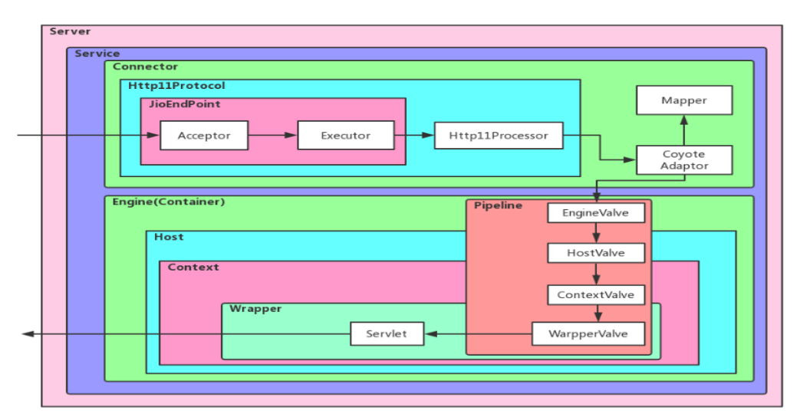

1. tomcat怎么修改配置端口
> conf文件夹中server.xml 文件，修改Connector中的port，默认8080
2. tomcat有哪几种Connector运行模式
>有4种模式，bio、nio、aio、apr
>- bio是同步阻塞IO，
>>+ maxThreads=”150”设置最大线程数，
>>+ minSpareThreads=”25”设置最小线程数，tomcat启动就会创建最小线程数，
>>+ maxSpareThreads=”75”，设置最大保留线程数
>>+ acceptCount=”100”,设置请求繁忙时待处理队列可存放请求数，
>>+ connectionTimeout=”20000”
>- nio是JDK1.4 开始支持，同步阻塞或同步非阻塞 IO,tomcat8默认使用nio。
>- aio(nio.2)是JDK7 开始支持，异步非阻塞 IO
>- apr是Tomcat 将以 JNI 的形式调用 Apache HTTP 服务器的核心动态链接库来
>处理文件读取或网络传输操作，从而大大地 提高Tomcat对静态文件的处理性能
3. tomcat部署方式
>- 直接把 Web 项目放在 webapps 下，Tomcat 会自动将其部署
>- 在 server.xml 文件上配置<Context>节点，设置相关的属性即可
>- 通过 Catalina 来进行配置:进入到 conf\Catalina\localhost 文件下，创建一个
> xml 文件，该文件的名字就是站点的名字。编写 XML 的方式来进行设置,此方式灵活，具体如下。
```
<?xml version="1.0" encoding="UTF-8"?>
<Context docBase="d:/Demo1" reloadable="true"></Context>
```
4. tomcat 容器是如何创建 servlet 类实例?
> 容器启动时，对wwebapps下的所有web.xml文件解析，配置中注册的servlet根据
> Load-on-startup值进行反射加载，小于0时在使用时才加载
5. tomcat 如何优化?
>- 配置URIEncoding="UTF-8",使得 tomcat 可以解析含有中文名的文件的 url
>- 配置合适的线程数
>>+ maxThreads=”150”设置最大线程数，
>>+ minSpareThreads=”25”设置最小线程数，影响tomcat启动速度
>>+ maxSpareThreads=”75”，设置最大保留线程数
>>+ acceptCount=”100”,设置请求繁忙时待处理队列可存放请求数，
>>+ connectionTimeout=”20000”
>- 压缩传输view，compression=”on” compressionMinSize=”2048′′
compressableMimeType=”text/html,text/xml,text/JavaScript,text/css,text/plain”
>- 设置合适的内存大小
>- GC配置优化
6. 监视 Tomcat 的内存使用情况
>- 使用 JDK 自带的 jconsole 可以比较明了的看到内存的使用情况，线程的状态，
> 当前加载的类的总量等;
>- JDK 自带的 jvisualvm 可以下载插件(如 GC 等)，可以查看更丰富的信息。
> 如果是分析本地的 Tomcat 的话，还可以进行内存抽样等，检查每个类的使用 情况
7. 打印类的加载情况及对象的回收情况
> 可以通过配置 JVM 的启动参数，打印这些信息
>+ -XX:+PrintGC
>+ -XX:+PrintGCDetails
>+ -XX:+PrintGCTimeStamps
>+ -XX:+PrintGCApplicationConcurrentTime,打印每次垃圾回收前，程序未中断 的执行时间
>+ -XX:+PrintGCApplicationStoppedTime,打印GC程序暂停时间
>+ -XX:PrintHeapAtGC



8. Tomcat 一个请求的完整过程
>* 请求被发送到本机端口 8080，被在那里侦听的 Connector 获得<br>
>* Connector 把该请求交给它所在的 Service 的 Engine 来处理，
> 并等待来自 Engine 的回应<br>
>* Engine 获得请求 localhost/yy/index.jsp，匹配它所拥有的所有虚拟主机 Host<br>
>* Engine 匹配到名为 localhost 的 Host(即使匹配不到也把请求交给该 Host 处理，
> 因为该 Host 被定义为该 Engine 的默认主机)<br>
>* localhost Host 获得请求/yy/index.jsp，匹配它所拥有的所有 Context<br>
>* Host 匹配到路径为/yy 的 Context(如果匹配不到就把该请求交给路径名 为”“的 Context 去处理)<br>
>* path=”/yy”的Context获得请求/index.jsp，在它的mapping table中寻找 对应的 servlet<br>
>* Context 匹配到 URL PATTERN 为*.jsp 的 servlet，对应于 JspServlet 类<br>
>* 构造 HttpServletRequest 对象和 HttpServletResponse 对象，作为参数调用 JspServlet 的 doGet 或 doPost 方法<br>
>* Context 把执行完了之后的 HttpServletResponse 对象返回给 Host<br>
>* Host 把 HttpServletResponse 对象返回给 Engine<br>
>* Engine 把 HttpServletResponse 对象返回给 Connector<br>
>* Connector 把 HttpServletResponse 对象返回给客户 browser<br>
9. Tomcat 工作模式?
> Tomcat 是一个 JSP/Servlet 容器。其作为 Servlet 容器，有三种工作模式
>>+ 独立的 Servlet 容器
>>+ 进程内的 Servlet 容器
>>+ 进程外的 Servlet 容器。

> 进入 Tomcat 的请求可以根据 Tomcat 的工作模式分为如下两类:
>>+ Tomcat 作为应用程序服务器:请求来自于前端的 web 服务器，这可能是 Apache, IIS, Nginx 等;
>>+ Tomcat 作为独立服务器:请求来自于 web 浏览器


