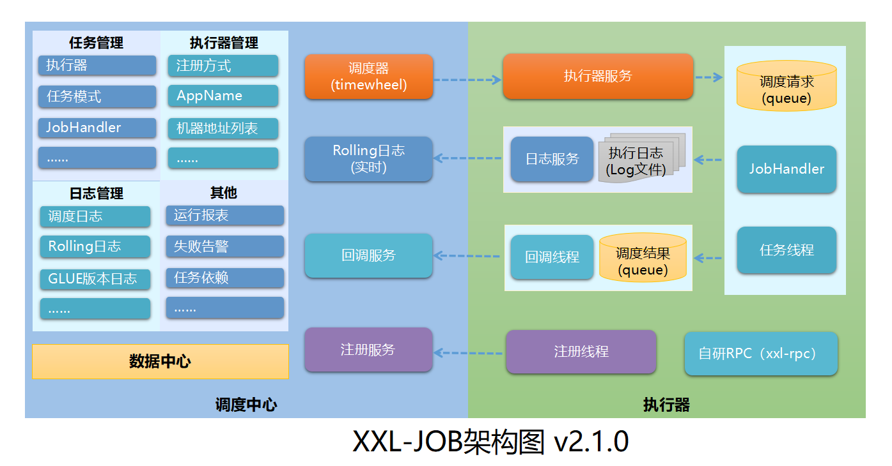

#### Quartz Scheduler
>开源任务调度框架,
##### simple use
1.注册Job
- 方式1,实现job接口,通过JobDetailFactoryBean注册，JobDataMap传送参数
```java
public class SimpleJob implements Job {
    public void execute(JobExecutionContext jobExecutionContext) throws JobExecutionException {
        JobDataMap jobDataMap = jobExecutionContext.getJobDetail().getJobDataMap();
    }
}
```
- 方式2,通过 MethodInvokingJobDetailFactoryBean 注册,指定job类和执行的方法
```java
@Component
public class SimpleService {
    public void exec(){
        System.out.println("SimpleService业务方法执行...." + ",线程号："+Thread.currentThread().getName());
    }
}
```
2.注册trigger,
- SimpleTriggerFactoryBean简单trigger注册(简单定时循环)
- CronTriggerFactoryBean注册(自定义cron公式,自定义定时方式，秒 分 时 DayofMonth Month DayofWeek Year)

3.注册scheduler
- SchedulerFactoryBean
***
***
####spring注解Scheduled 模式
1. 开启注解 EnableScheduling 
2. 配置线程池---触发器和任务共用的
```
@Bean(destroyMethod="shutdown")
public Executor taskExecutor() {
   return Executors.newScheduledThreadPool(10);
}
```
3.注解@Scheduled(cron="0/5 * * * * ?")
***
***
####E-JOB模式
>基于Quartz为基础，zookeeper做协调的分布式任务调度框架
- 注册的监听需要实现ElasticJobListener 监听接口
- 注册异常处理需要实现JobExceptionHandler 接口
>常用参数简介
* cron 
* shardingTotalCount 分片总数
* shardingItemParameters 分片参数
* listener 监听
* jobExceptionHandler 异常处理
* misfire 是否开启错过的任务重新执行
* jobParameter 作业自定义参数
```java
@ElasticJobConf(name = "simpleEJob", cron = "0/2 * * * * ?",
        shardingItemParameters = "0=beijing|shanghai|tianjin,1=shanghai", shardingTotalCount = 2,//分片
        listener = "com.hy.ejob.handle.TestSimpleListener", jobExceptionHandler = "com.hy.ejob.handle.TestSimpleExceptionHandle"
        )
public class TestSimpleJob implements SimpleJob {
    public void execute(ShardingContext shardingContext) {
//        System.err.println(shardingContext.toString());
        System.out.println(String.format("【%s】执行，参数【%s】", shardingContext.getJobName(), shardingContext.getShardingParameter()));
    }
}
```
***
***
####XXL-JOB
>一款基于spring、Quartz、netty、mysql的分布式任务调度框架（文档很详细）
- [中文文档](https://www.xuxueli.com/xxl-job/)
- [社区交流](https://www.xuxueli.com/page/community.html)

源码仓库地址 | Release Download
--- | ---
[https://github.com/xuxueli/xxl-job](https://github.com/xuxueli/xxl-job) | [Download](https://github.com/xuxueli/xxl-job/releases)  
[http://gitee.com/xuxueli0323/xxl-job](http://gitee.com/xuxueli0323/xxl-job) | [Download](http://gitee.com/xuxueli0323/xxl-job/releases)
>源码执行过程
>+ ThreadPoolExecutor线程池执行任务，XxlJobTrigger.trigger 
>+ processTrigger 
>>1. save log-id 保存日志，返回日志id
>>2. init trigger-param 初始化触发器的参数
>>3. init address 初始化任务执行地址
>>4. trigger remote executor，获取ExecutorBiz 执行run，xxlRpc通过netty，调用实现的jobbean，执行任务
>>5. collection trigger info 组装执行结果
>>6. save log trigger-info 保存执行结果日志
