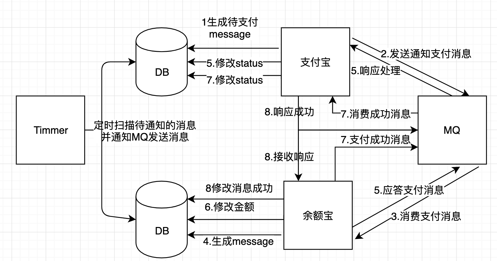

1. 扫码支付，支付宝生成message，status待通知，通过mq通知余额宝，定时器定时扫描待通知消息进行发送
2. 余额宝收到请求，添加相同message，并响应消息，支付宝收到响应改message状态为已通知
3. 余额宝进修改DB金额行支付操作，扣款成功，修改status已支付，通过mq通知余额宝支付成功，
定时器定时扫描支付成功待通知消息进行发送
4. 支付宝收到通知响应消息，改message状态为已支付，余额宝收到响应改通知状态为已通知

