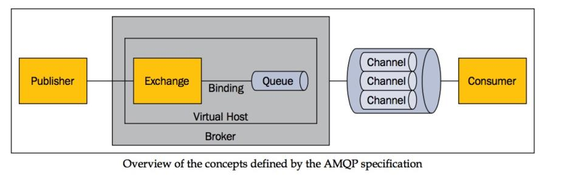

1. AMQP简介
> AMQP（Advanced Message Queuing Protocol，高级消息队列协议）
是一个进程间传递异步消息的网络协议,主要实现为RabbitMQ。

> AMQP模型
>- 生产者:消息的创建者，发送消息到rabbitmq；
>- 消费者：连接到rabbitmq，订阅到队列上进行消费消息，持续订阅(basicConsumer)和单条订阅(basicGet).
>- 消息：包含有效载荷和标签，有效载荷指要传输的数据，，标签描述了有效载荷，
并且rabbitmq用它来决定谁获得消息，消费者只能拿到有效载荷，并不知道生产者是谁
>- `信道`：生产者与消费者均通过信道与MQ通信，一个TCP连接有成百上千个信道来达到多线程
处理，
>- `交换器、队列、绑定、路由键`,`队列`通过`路由键`（routing  key，某种确定的规则）`绑定`到`交换器`，
`生产者`将消息发布到`交换器`，`交换器`根据`绑定`的`路由键`将`消息`路由到特定`队列`，然后由订阅这个队列的`消费者`进行接收

2. RabbitMQ 中的 Broker 是指什么？Cluster 又是指什么？
>- broker 是指一个或多个 erlang node 的逻辑分组，且 node 上运行着 RabbitMQ 应用程序
>- cluster 是在 broker 的基础之上，增加了 node 之间共享元数据的约束

3. 什么是元数据？元数据分为哪些类型？包括哪些内容
>在非 Cluster 模式下，元数据主要分为：
>- Queue 元数据（queue 的名字和属性等），具有自己的 erlang 进程
>- Exchange 元数据（exchange 名字、类型和属性等），内部实现为保存 binding 关系的查找表
>- Binding 元数据（存放路由关系的查找表）
>- Vhost 元数据（vhost 范围内针对前三者的名字空间约束和安全属性设置），拥有独立的权限，
可用来做范围控制。

4. 如何确保消息正确地发送至 RabbitMQ？
> RabbitMQ 使用发送方确认模式，确保消息正确地发送到 RabbitMQ 
当采用channel.confirmSelect();开启确认者发送模式后，可采用以下方法确认消息，
>- channel.addConfirmListener()添加异步监听发送方确认模式
>- channel.waitForConfirms()普通发送方确认模式；消息到达交换器，就会返回true
>- channel.waitForConfirmsOrDie()批量确认模式；只要有一个未确认就会IOException

5. 常用的交换器有哪些
>- direct是精准匹配，对于匹配符合的消费者都推送消息
>- fanout是广播式发送，所有消费者均能收到消息
>- topic，通过"."分割路由键,"*"进行1个匹配,"#"N个匹配，
>- headers(通direct差不多)

6. metadata的存储方式 RAM node和disk node
>- RAM node,将queue、exchange 和 binding等 RabbitMQ基础构件存储在内存中，
>- disk node,不但保存到内存中，还会保存到磁盘上，一个cluster至少有一个disk node用来持久化

7. 在单 node 系统和多 node 构成的 cluster 系统中声明 queue、exchange ，以及 进行 binding 会有什么不同?
>- 单 node 上声明 queue 时，只要`该 node `上相关元数据进行了变更，你就会 得到
 Queue.Declare-ok 回应
>- cluster 上声明 queue ，则要求 cluster 上的`全部 node `都要进行元数据成功更新，
才会得到 Queue.Declare-ok 回应。另外，若 node 类型 为 RAM node 则变更的数据仅
保存在内存中，若类型为 disk node 则还要变更保存在磁盘 上的数据。

8. cluster 中拥有某个 queue 的 owner node 失效了,其他node能否重新声明
>- durable持久化的queue只能重新恢复才能使用该queue
>- 非durable的可以重新声明

9. 能够在地理上分开的不同数据中心使用 RabbitMQ cluster 么
>- 无法控制所创建的 queue 实际分布在 cluster 里的哪个 node 上(一 般使用
HAProxy + cluster 模型时都是这样)，这可能会导致各种跨地域访问时的常见问题
>- Erlang 的 OTP 通信框架对延迟的容忍度有限，这可能会触发各种超时，导致 业务疲于处理
>- 在广域网上的连接失效问题将导致经典的“脑裂”问题，而 RabbitMQ 目前无法处理

10. routing_key 和 binding_key 的最大长度是多少
> 255字节

11. 向不存在的 exchange 发 publish 消息会发生什么
> 都会收到 Channel.Close 信令告之不存在(内含原因 404 NOT_FOUND)

12. 什么情况下 producer 不主动创建 queue 是安全的?
>- message 是允许丢失的
>- 实现了针对未处理消息的 republish 功能(例如采用 Publisher Confirm 机制)。

13. 死信交换器DLX(
> 一个普通交换器,在队列声明参数 x-dead-letter-exchange 开启,x-dead-letter-routing-key，后
当发生以下情况，消息会进入死信队列：
>- 消息被拒绝,requeue参数为false
>- 消息过期
>- 队列达到最长长度

> 死信和备用的区别
>- 备用是路由失败的消息，死信是路由成功拒绝或未响应的消息
>- 备用是在队列申明，死信是在交换器申明

14. 什么情况下会出现 blackholed 黑洞问题?
> blackholed 问题是指，向 exchange 投递了 message ，而由于各种原因导致该
message 丢失，但发送者却不知道。可以通过 mandatory=true，来接收路由失败的消息 
> 可导致 blackholed 的情况:
>- 向未绑定 queue 的 exchange 发送 message
>- exchange 以 binding_key  key_A 绑定了一个 queue queue_A，但向 该
exchange 发送 message 使用的 routing_key 却是 key_B。

15. Consumer Cancellation Notification 取消机制用于什么场景?
> 用于保证当镜像 queue 中 master 挂掉时，连接到 slave 上的 consumer 可以收到
自身 consume 被取消的通知，进而可以重新执行 consume 动作从新选出的 master 处获得
消息。若不采用该机制，连接到 slave 上的 consumer 将不会感知 master 挂掉这个事
情，导致后续无法再收到新 master 广播出来的 message 。另外，因为在镜像 queue 模式
下，存在将 message 进行 requeue 的可能，所以实现 consumer 的逻辑时需要能够正确
处理出现重复 message 的情况

16. 消息的拒绝
> 消息消费异常,拒绝回mq,进行重新发送给其他消费者消费
>- reject 拒绝单条消息channel.basicReject(envelope.getDeliveryTag(),false);
>- Nack 多条拒绝

17. 为什么不应该对所有的 message 都使用持久化机制?
> 仅对关键消息作持久化处理(根据业务重要程度)，且应该保证关键消息的量不会导致性能瓶颈
>- 性能影响
>- queue持久化会导致无法重新声明，而丢失消息

18. 