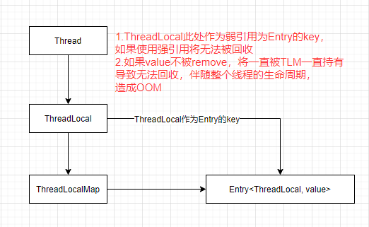
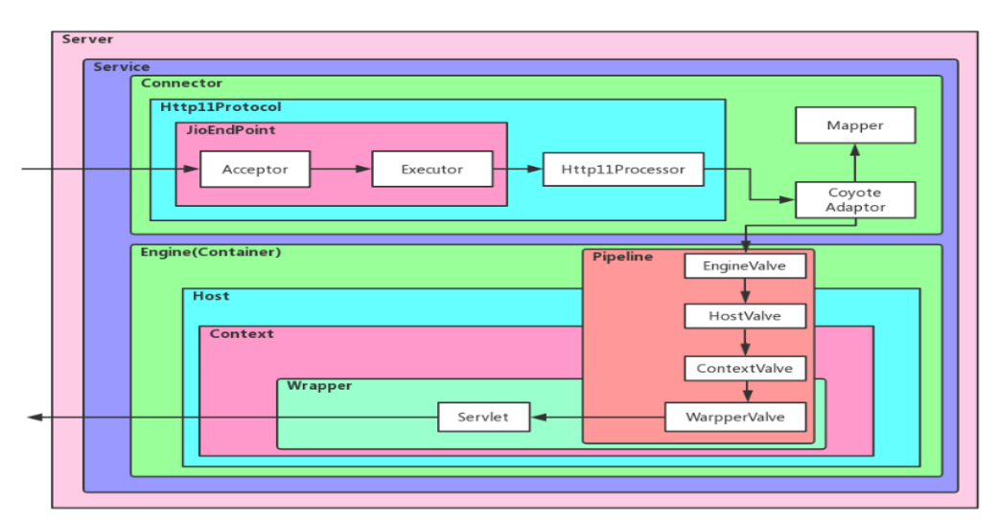

1. Synchronized原理
> Syn是由JVM实现的一种互斥同步的方式，通过指令`monitorenter`和`monitorexit`两个字节码
> 指令控制，执行menter指令时，如果这个对象没有锁定或者当前线程已经锁定这个对象，会把锁计数器
>+1，当执行mexit时，会-1，当计数器为0时，锁就被释放了
2. Syn锁定的对象
> Syn可以锁定`对象`、锁定`代码块`、锁定`方法`
3. jvm对java原生锁进行哪些优化
>- 进行短时间自旋`减少了用户态和到内核态的切换`，
>- 通过`偏向锁(在锁头标记线程ID)`、`轻量锁（CAS）`、`重量锁`的`升级、降级`减少锁的竞争开销
4. 为什么Syn是非公平锁
> 非公平主要表现在获取锁的行为上，并非是`按照申请锁的时间`
> 前后给等待线程分配锁的，每当锁被释放后，任何一个线程都有机会竞争到锁，
> 这样做的目的是为了提高执行性能，缺点是可能会产生`线程饥饿`现象。
5. 什么是锁消除和锁粗化
>- 锁消除是JVM在编译时检测到`不可能存在锁竞争`的情况，进行锁消除，主要根据逃逸分析
>- 锁粗化指减少`没必要的重复加锁和解锁`，增大锁的作用域
6. 为什么syn是悲观锁，乐观锁是什么，CAS原理和特性是什么，
>- syn不管是否有竞争，任何数据都必须进行`加锁、用户核心态转换、维护锁计数器、检查阻塞`等情况
>- 乐观锁的核心算法是`CAS`（compare and swap），通过`volatile`在内存中公开`一个对象`，
> 当且仅当`内存值`为`预期值`时，才赋予`新值`，否则自旋继续进行非阻塞式同步，
>- CAS优缺点：提高了并发性能，但只能保证`共享一个变量`的原子操作，存在ABA问题，需要用版本戳，长期
>- `自旋产生性能消耗`
7. Syn和显示锁Lock
> 显示锁具有更高的`灵活性`，提供中断、获取超时时间等操作方法，实现`基于AQS`实现， 
> Syn竞争不激烈的情况下效率高于ReetrantLock 
> ReetrantLock为公平锁，
8. AQS是什么
> AQS一种实现`阻塞锁`和一系列`依赖FIFO`等待队列的`同步器`的框架,
>- 定义了一个volatile int `state` 变量，表示同步状态,=0时表示没有锁，加锁对state进行+1，释放锁进行-1 
>- 构建`Node双向链表`锁队列，进行锁排队(so是个公平锁) 
>> 一. 进入`acquire`可以看到`addWaiter()`将本次aquire请求打包为一个node添加到链表中   
>> 二.`自旋`尝试获取锁，当前驱结点为`头结点`，参与锁竞争 
>> 三.否则需要会被`LockSupport.park`(this) 进行阻塞 
>> 四.当release的时候，`LockSupport.unpark`(s.thread)释放当前节点的next节点
9. 常用的JUC并发工具
> CountDownLatch、 CyclicBarrier、 Semaphore 等`同步工具` 
> ConcurrentHashMap、有序的ConcunrrentSkipListMap、CopyOnWriteArrayList等`安全容器` 
> ArrayBlockingQueue、SynchorousQueue等`阻塞队列` 
> 强大的 Executor 框架,各种`线程池`
10. ReadWriteLock 和 StampedLock
> StampedLock是1.8提供的读写锁，支持读优化，`validate()`方法可以确认是否进如了读模式，避免重复锁开销
11. 如何让线程彼此同步，有哪些同步器
>- `CountDownLatch`，一个/多个线程通过await进入等待，在通过countDown进行释放，当计数器变为0后可执行
>- `CyclicBarrirer `,一组线程全部到达await()屏障后放开屏障执行
>- `Semaphore` 构建固定连接池，进行acquire池中没有连接进入等待，当release释放会唤醒等待，通常用在流量控制
12. java中线程池是如何实现的
> 通过构建`一组worker线程`来执行`BlockingQueue中`的`Runnable/Callable`，核心参数有： 
>- corePoolSize  核心线程数量
>- maximumPoolSize
>- keepAliveTime
>- TimeUnit 时间单位
>- queue 存放任务的队列
>- ThreadFactory 现场创建工厂
>- handler 队列满了，线程满了任务的拒绝策略 
> 常用线程池有以下这些
>- ThreadPoolExecutor,最常用的任务线程池，可构建SingleThreadExecutor、FixedThreadPool 等
>- ScheduledThreadPool,执行一些周期性任务线程池
>- ForkJoinPool，分治法线程池，task需要继承ForkJoinTask，一般继承RecursiveTask，实现自ForkJoinTask

13. ThreadPoolExecutor执行过程
>- 检查核心线程数，如果小于核心线程数尝试新建线程为当前任务分配线程执行任务，任务的添加和查看以ReentrantLock来保证原子性
>- 任务offer到queue排队，同时重新检查运行状态，必要事回滚队列
>- 如果队列剩余数量为0则新建线程
>- 排队失败则添加worker，如果woker也添加失败则通过handler策略拒绝任务
13. volatile的特点
> volatile是jvm提供的`轻量同步机制`，volatile修饰的变量对所有线程都是`可见`的，能够`阻止
> JVM进行重排序`优化，但`不保证代码执行顺序`(遵循`happen before 原则`)
14. ThreadLocal 怎么解决并发安全
> java提供的一种`线程私有信息机制`，`ThreadLocal为弱应用key`，使用需要注意remove，否则会一直伴随着
> 线程共生，造成`OOM问题`

15. 影响线程性能有哪些因素,怎么优化
>- `上下文切换`(线程之间的切换)
>- `内存同步`(锁指令,需要刷新缓存)
>- `阻塞`(导致挂起，唤醒，重新排队，导致多余上下文切换) 

> 优化方案
>- 减小`锁粒度`
>- 减小`锁的范围`(如：锁代码块)
>- `锁分段`(如：CurrentHashMap)
>- 替换`独占锁`(根据实际情况采用CAS、读写锁、并发容器等工具)
16. 线程之间怎么通信
>- `共享内存`
>- `消息传递`java中通常通过 wait()和notify()进行传递消息

17. 线程的基础信息
> 启动/终止线程
>- Thread/Runnable/Callable
>- 安全中断线程
>>- 优先使用`interrupt中断`处理InterruptException进行线程中断
>>- `全局变量控制中断线程`

> 状态
>- 状态(就绪(start)、阻塞(sleep/wait)、运行(running)、结束(安全中断线程))

> 线程协作
>- 等待和通知机制,`wait/notify/notfyAll`(Object方法)，必须要锁，等待和通知的标准范式
,notify/notfyAll,notify只能唤醒一次,一般用notifyAll,避免信号丢失
>- `join`方法(等待前一个线程执行完毕)
>- `yield`(让出CPU进入就绪,不放锁)
>- `sleep`/wait都会进入阻塞，sleep不放锁，wait/notify使用需要锁住同一对象

18. `Foke/Join`机制
> 分而治之算法是将一个大的`任务拆分`为N个任务`并发执行`，最终在进行`汇总`的一种算法思想，
提高计算效率和充分利用CPU的计算能力

>JDK提供了一套标准的Foke/Join算法模型，
>- FokeJoinPool、task(invokeAll()添加子任务、join()合并子任务)）
>- 分而治之,分治法(阈值N区分进行大任务拆分，递归拆分任务，直到任务可执行)
>- 工作密取/工作窃取(从头执行，从尾窃取，做完扔回尾部)

19. JDK代理与CGLib代理
>- JDK代理是不需要第三方库支持，只需要JDK环境就可以进行代理，使用条件: 
> 1）实现InvocationHandler 
> 2）使用Proxy.newProxyInstance产生代理对象 
> 3）被代理的对象必须要实现接口 
>- CGLib必须依赖于CGLib的类库，但是它需要类来实现任何接口代理的是指定的类生成一个子类，
> CGLib不能对声明为final的方法进行代理

19. HashMap、ConcurentHashMap
