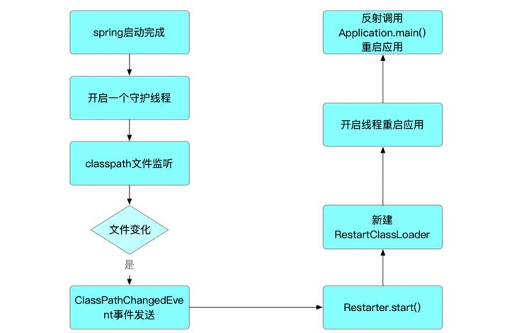

1. 内存模型以及分区
> JVM分为虚拟机栈、堆、方法区、本地方法区
>- `堆`，用来存放实例化对象、非static成员变量,属于`线程共享`的，并发处理的主要就是
> 堆中的共享
>- `虚拟机栈`，由`栈帧`组成，每个方法运行打包成一个栈帧，当前正在执行的方法就是
>虚拟机栈顶的栈帧，栈帧缺省大小1M，可通过`-Xss 256k` (等同于 -XX:ThreadStackSize)进行设置,栈帧由`局部变量表`、
>`操作栈`、`动态连接`、`返回地址`
>- `方法区`，用来存放类信息、静态常量编译后的字节码文件等，
>- `本地方法区`，用来存放native方法服务
>- `程序计数器`，记录程序执行的行号
2. 堆的内存区域划分和特点
> 分为`新生代`、`老年代`、`永久代`(永久代1.8及以后替换为`metaspcace元空间`)
>- 新生代，包含Eden区和`survivor` `from`、`to`区，分配比例为8：1：1，新建对象存放在Eden区，当Eden区空间
>不足会触发GC进行回收，幸存者进入survivor区，由于回收率较高一般采用`复制算法`
>- 老年代，经过`N次GC后幸存的对象`会进入老年代，`大对象`创建会直接放入老年代，当`老年代
>空间不足`时触发`full GC`
3. GC 的判定方法
>- `引用计数法`，当对象被引用时计数器+1，被释放时，计数器-1，当为0则会被回收，会存在相互
> 引用的问题
>- `可达性分析法`，是通过计算GC roots的对象向下搜索，不能达到的对象进行回收，GC roots
> 对象有以下几种 
>> ①虚拟机栈中引用的对象 
>> ②方法区类静态属性引用的对象 
>> ③方法区常量池引用的对象 
>> ④本地方法栈 JNI 引用的对象 
4. GC有哪些内存回收算法
>- `复制算法`，会`浪费一半内存`，内存移动，需要修改引用
>- `标记清除`，产生大量`不连续的碎片内存`，大内存分配不便
>- `标记整理`,通过标记、整理、删除，优点是内存连续但`耗时长`
5. GC收集器有哪些，特点是什么
>- `serial`是`新生代收`集器，`单线程`独占，速度快，会阻塞，采用`复制算法`
>- `ParNew`是`新生代`收集器，`多线程`版serial，采用`复制算法`
>- `Parallel Scavenge`，`吞吐量优先`的`新生代收`集器，采用`复制算法`，`多线程`回收，适合后台运算，不需要太多交互任务
>- `Serial Old`，`老年代`收集器，采用`单线程`，采用`标记整理`算法
>- `Parallel`，`老年代`收集器，`多线程`，注重吞吐量(执行时长/(执行时长+垃圾回收时间) 即使用率)，采用`标记整理`
>- `CMS`是`并行与并发`的收集器，收集时间短，适合快速响应，采用`标记清除`算法，JVM可以设置`N次FGC`后进行一次标
> 记整理,执行过程如下 
>> 一、`初始`标记，短暂STW,标记GC roots可达的对象引用 
>> 二、`并发`标记，GC roots Tracing(GC roots 追踪) 
>> 三、`重新`标记，短暂STW，修整标记期间变动记录 
>> 四、`并发`清理。两次STW时间都比较短，整体来算是并发的。 
>- `G1`,跨越新老年代,将内存切分为N个`region局部块`，每块都有新老年代，整体采用标记整理算法，
> 只对部分region区域进行增量清理，所以G1的STW时间短，整体执行过程如下
>>1. 新生代GC,Eden清空，幸存进入survivor 
>>2. 并发清除周期,具体步骤如下， 
>>>a.根区域扫描,survivor能进入olden的 
>>>b.并发标记 
>>>c.重新标记 
>>>d.独占标记 
>>>e.并发清除 
>>3. 混合回收，含有垃圾比例高的region进行回收 
>>4. 可能的fullGC 
>- `ZGC`，内存划分为一个个region区，没有分代概念,每次清理所有的region，采用分区复制进行清理
> ,执行过程如下，
>>1. Pause Mark Start 初始停顿标记
>>2. Concurrent Mark并发标记，递归标记其他对象
>>3. Relocate移动对象
>>4. Remap － 修正指针
6. 简述JVM垃圾回收机制
> JVM采用了一个`垃圾回收的守护线程`，当虚拟机`空闲或堆内存不足`时，才会触发执行，扫描
> 未被引用的对象，把它们添加到要回收的集合中，进行回收
7. java内存模型是什么
>java 内存模型(JMM)是`线程间通信的控制机制`,JMM 定义了主内存和线程之间抽象关系。
>线程之间的共享变量存储在`主内存(main memory)`中，每个线程都有一个私有的
>`本地内存(local memory)`，本地内存中存储了该线程以读/写共享变量的`副本`。
>本地内存是 JMM 的一个抽象概念，并不真实存在。它涵盖了缓存，写缓冲区，
>寄存器以及其他的硬 件和编译器优化。
8. 类的加载过程
>- `加载`，首先加载`二进制字节流`，并转换成方法区或元空间的`运行时结构`，在内存中生成`class
> 对象`作为方法区或元空间的`入口`
>- `连接`，连接分为三步， 
>1.验证，验证文件格式(即千4字节魔数)、元数据、字节码等等 
>2.准备，类变量进行初始化和分配内存 
>3.解析，将常量池中符号引用替换为直接引用 
>- `初始化`，`clinit指令`对构造方法执行变量的赋值,`只能有一个线程`能执行这个类的clinit，
>多线程环境中被正确地加锁、同步,耗时很长的操作(大对象),可能造成多个进程阻塞
>- 使用
>- 卸载
9. 类加载器双亲委派模型机制是什么
> 当一个类收到了类加载请求时，不会自己先去加载这个类，而是将其`委派给父类`，由父类 去加载，
>如果此时`父类不能加载，反馈给子类`，由子类去完成类的加载。类加载器主要有如下四种
>- 启动加载器（Bootstrap）,用来加载java核心类库，如:jre/lib/ext
>- 扩展类加载器（Extension）,用来加载java的扩展库
>- 系统类加载器(system class loader)根据 Java 应用的类路径(CLASSPATH) 来加载 Java 类
>- 应用加载器（Application），用户自定义类加载器，通过继承 java.lang.ClassLoader 类的方式实现。
10. Java 类加载器（ClassLoader）的实际使用场景有哪些？
>- 解决依赖冲突，通过自定义类加载器，为每个中间件自定义一个加载器，这些加载器之间的关系是平行的，彼此没有依赖关系。这样每个中间件的classloader就可以加载各自版本的jar包
>- 热加载

>- 热部署
>- 加密保护，打包加密，自定义classloader加载class时解密
11. 性能优化
>性能优化按结构分可分为3类
>- 前端
>>+ 客户端减少请求
>>+ CDN加速加载资源
>>+ 反向代理缓存(静态资源存放nginx)
>>+ web组件分离(js/css/图片放在不同服务，加大浏览器并发数)
>- 服务端优化
>>+ 缓存(优先第一考虑原则),缓存离用户越近越好，减少多余请求，如：redis、memcach
>>+ 异步处理(可以有效避免阻塞)，如：serverlet异步、多线程、消息队列
>>+ 集群(更多机器，提供更高的吞吐量)
>- 程序
>>+ 合适的数据结构(集合给定容器长度，减少扩容)
>>+ 更优的算法/更少的代码
>>+ 并发编程(充分利用CPU资源，需要避免线程安全)
>>+ 减少锁竞争(轻量锁、偏向锁如CAS、读写锁)
>>+ 单例模式
>>+ 池化技术