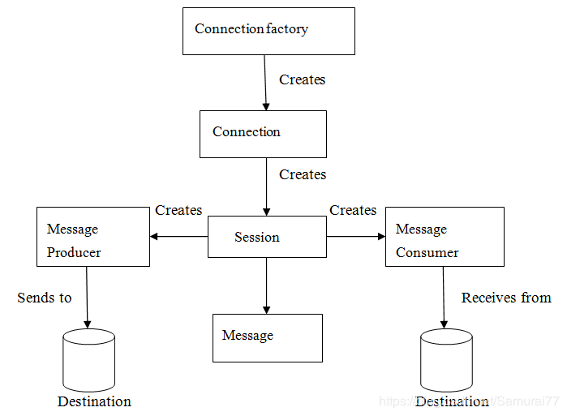
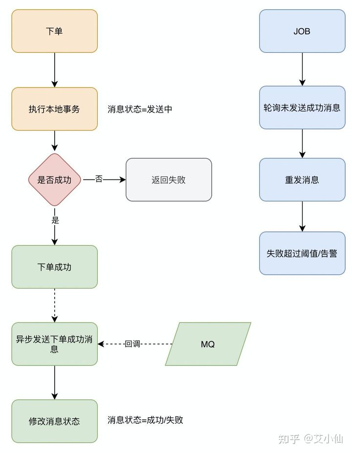

1. mq简介
> 利用高效可靠的异步消息传递机制对分布式系统中的其余各个子系统进行集成

>特点
>- 分布式系统之间消息的传递
>- 提高分布式系统与其他子系统的伸缩性和扩展性
>- 低耦合，降低应用之间的耦合性，有解耦作用
>- 异步通信，进行异步处理业务
>- 缓冲能力,可用来削峰
>- 系统可用性降低、系统复杂性提高、存在一致性问题

> 与RPC区别
>- RPC是模块与模块之间的调用，存在依赖性，适用于快速响应、同步处理的业务。
>- MQ是多系统之间的消息传递，系统间存在队列管理消息，适用于不需要响应，或实时性不高的场景
>- 都是分布式方式下通信

2. JMS简介
> JMS是java关于消息中间件的规范

> JMS 模型
>- 连接工厂,ConnectionFactory
>- JMS连接,Connection,conn.start();
>- JMS会话,Session
>- JMS目的,Destination
>- JMS生产者/消费者Productoer/Consumer
>- 消息发送/注册消息监听

> JMS消息模型
>- P2P(点对点)
>- Topic/主题(发布和订阅)

3. 什么是 ActiveMQ?
> 实现了JMS1.1规范的MQ框架

4. ActiveMQ宕机、丢消息怎么处理？
>- 对消息做持久化，p2p消息会自动持久化，需要处理的是topic消息的持久化
>- 开启事务对消息进行应答确认处理
>- JMSReplyTo,接收cosumer reply 回来的Message

5. 消息的不均匀消费
> 根据不同的服务设置合适的prefetch，预取数量，避免消息分配不均

6. 死信队列是什么
> 用来保存处理失败或过期的消息的队列，本质也是一个队列，发生以下情况会进入死信队列：
>- 事物会话被回滚
>- 事物会话提交之前关闭
>- 客户端手动确认模式，调用session.recover
>- 自动应答失败

7.ActiveMQ的消息重发机制
>- 消费者接收到消息处理后未进行响应，会对这条消息进行重发
>- 预取模式下，消费者未对本次接收的消息进行响应，生产者会对这些消息全部进行重发
>- session事务模式下，未进行确认，会重新发送本次事务的消息

8. 分布式MQ下单场景方案
>- 下单后先保存本地数据和MQ消息表，这时候消息的状态是发送中，如果本地事务失败，那么下单失败，事务回滚。
>- 下单成功，直接返回客户端成功，异步发送MQ消息
>- MQ回调通知消息发送结果，对应更新数据库MQ发送状态
>- JOB轮询超过一定时间（时间根据业务配置）还未发送成功的消息去重试
>- 在监控平台配置或者JOB程序处理超过一定次数一直发送不成功的消息，告警，人工介入。

