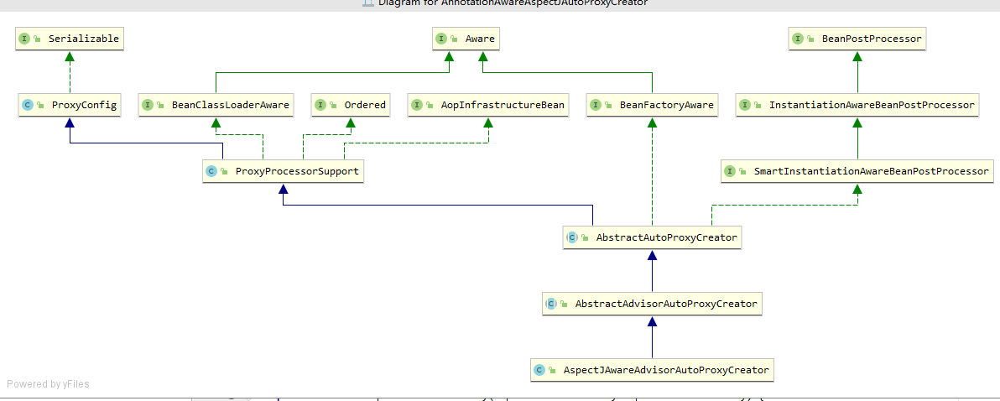

1. spring简介以及优点好处
> spring是一个非侵入式低耦合的一个框架，IOC控制管理bean，AOP增强bean，
> 声明式事务处理，以及Mybatis、Quartz、JMS等优秀框架的集合，大大方便的系统的开发
> 测试
2. Spring中的单例bean的线程安全问题
> 多个线程对非静态变量进行写操作会存在线程安全问题
>- 实例中不存在可变更修改的非静态变量是安全的
>- 用ThreadLocal存储可变变量，解决线程安全问题
3. bean的生命周期
>- Aware接口设置相关属性
>- BeanPostProcessor的postProcessBeforeInitialization()
>- InitializingBean接口方法
>- 指定的initMethod
>- BeanPostProcessor的postProcessAfterInitialization()
>- DisposableBean接口方法
>- 指定的destroyMethod
4. spring中用到的设计模式
>- BeanFactory 工厂模式
>> BeanFactory 提供getBean获取实例，ApplicationContext扩展自BeanFactory
>提供更多如国际化、上下文监听等扩展功能， 非懒加载单例和非单例采用延迟加载
>- AOP的代理模式
>> 通过AnnotationAwareAspectJAutoProxyCreator 实现BeanPostProcessor,
>实例初始化时进行Advisors增强

>- bean的创建单例模式
>> 采用ConcurrentHashMap 来缓存单例实例
>- xxxxTemplate的模板模式
>- AdvisorAdapter 的适配器模式
>- ApplicationListener的观察者模式
5. @Component和@Bean的区别是什么
>- Component注解类，自动扫包装配实例
>- Bean注解方法，返回实例，灵活性强
6. Spring事务管理的方式有几种？
>- 编程式事务，在业务逻辑中写入事务，灵活性差，耦合严重
>- 声明式事务，基于AOP方式，可注解或XML中灵活声明事务
7. spring的事务隔离级别
>- 采用后端数据库的隔离级别或自定义隔离性事务的4个级别
8. BeanFactory 和 ApplicationContext 有什么区别?
>- BeanFactory 提供bean的创建和生命周期的控制
>- ApplicationContext具有BeanFactory的功能，还提供国际化、统一资源读取方式等其他额外功能
9. bean的作用域
>- `@Scope("prototype")`,实例范围
>>+ prototype多实例；
>>+ singleton 默认，单利；
>>+ request，一次请求；
>>+ session 同一个session创建
10. spring的自动装配模式
>- byName模式
>- byType模式
>- 构造函数模式
>- 默认模式
>- 无
11. 如何开启基于注解的自动装配?
> 注册AutowiredAnnotationBeanPostProcessor实例
12. 请举例解释@Required 注解?
>- 注册RequiredAnnotationBeanPostProcesso 来验证 bean 属性
13. Spring 框架中有哪些不同类型的事件?
> Spring 的 ApplicationContext 提供了支持事件和代码中监听器的功能。
> 提供了5种监听事件，可通过实现一个ApplicationListener 接口并注入到容器中进行监听
>- 上下文更新事件(`ContextRefreshedEvent`):该事件会在ApplicationContext被初始化或者 更新时发布。也可以在调用 ConfigurableApplicationContext 接口中的 refresh()方法时被触 发。
>- 上下文开始事件(`ContextStartedEvent`):当容器调用ConfigurableApplicationContext的 Start()方法开始/重新开始容器时触发该事件。
>- 上下文停止事件(`ContextStoppedEvent`):当容器调用ConfigurableApplicationContext的 Stop()方法停止容器时触发该事件。
>- 上下文关闭事件(`ContextClosedEvent`):当ApplicationContext被关闭时触发该事件。容器 被关闭时，其管理的所有单例 Bean 都被销毁。
>- 请求处理事件(`RequestHandledEvent`):在Web应用中，当一个http请求(request)结束 触发该事件。
14. FileSystemResource 和 ClassPathResource 有何区别?
>- ClassPathResource 在环境变量中读取配置文件
>- FileSystemResource 在加载的配置文件 中读取配置文件

15. spring容器的初始化过程
>- 1.`prepareRefresh`（prepare 准备）校验环境、属性、数据正确性
>- 2.`obtainFreshBeanFactory`（obtain (尤指经努力) 获得，赢得; 存在; 流行; 沿袭）
 获取BeanFactory实例，
>- 3.`prepareBeanFactory`，再准备BeanFactory的后续工作，包含注册classLoader类加载器
resource环境 Aware接口等
>- 4.postProcessBeanFactory（spring预留自定义增强BeanFactory接口）
>- 5.`invokeBeanFactoryPostProcessors` （invokeBFPP 调用执行BeanFactory的增强器，
包括用户自定义扩展的增强器）
>- 6.`registerBeanPostProcessors`（registBPP 注册其他bean增强器，包括`AOP`，
`Transaction`等都在此注册，注册按照PriorityOrdered、Ordered、None进行注册，）
>- 7.initMessageSource（国际化，初始化信息源，注册`messageSource`的bean实例可实现自定义国际化）
>- 8initApplicationEventMulticaster（初始化事件派发器，
注册applicationEventMulticaster实例可实现自定义事件派发器）
>- 9.onrefresh（spring预留自定义扩展接口）
>- 10.registerListeners（给容器中将所有项目里面的ApplicationListener注册进来）
>- 11.`finishBeanFactoryInitialization`（finish init 加载bean，`单实例非懒加载bean`，将在此初始化，详细情况如下：）
>>- 先获取`RootBeanDefinition`bean实例定义
>>- 获取一个BeanWrapper，包装bean
>>- 正式实例化前
>>- initializeBean进行bean实例化
>>>+ Aware接口调用
>>>+ BeanPostProcessor 前置增强调用，如果此时获取到实例bean则返回实例
>>>+ bean实例化前被调用，如：InitializingBean接口、指定的init-method
>>>+ BeanPostProcessor后置增强调用，如：AOP、Transaction等advisor在此注册
>>>>* getAdvicesAndAdvisorsForBean,获取所有Advisors增强到bean上，供方法增强
>时使用

>- 12.finishRefresh（finish 结束）